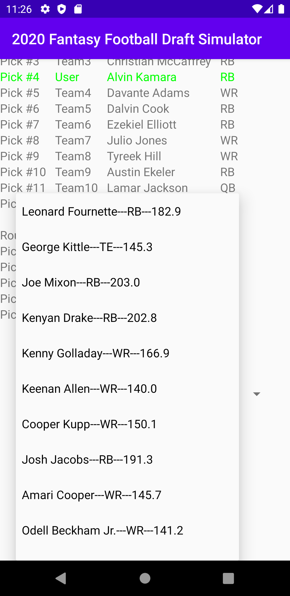
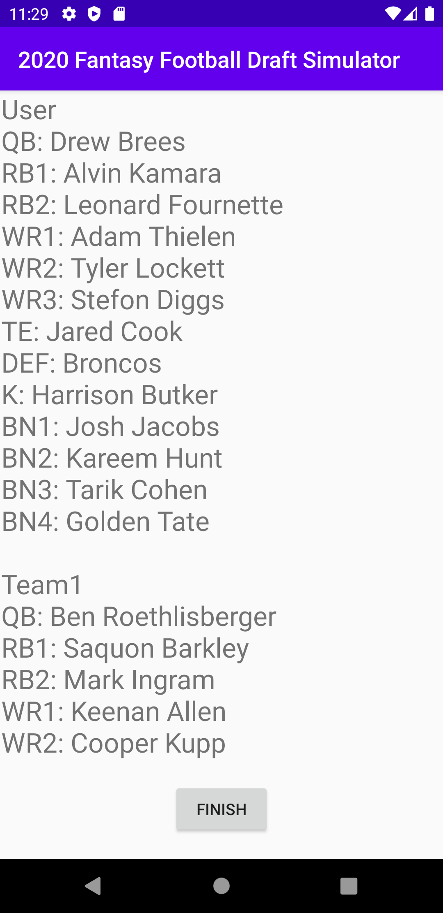

# 2020 Fantasy Football Draft Simulator
## Project Introduction

This app allows users to prepare for their upcoming fantasy football drafts by conducting mock drafts. Users can toggle the number of teams in the draft and practice different strategies in order to stay ahead of their competition on draft day.

## Prerequisites

You will need a an Android device with access to the Google Play Store to download this application.

## Installation

1. Navigate to the Google Play Store on your Android device.
2. Search "2020 Fantasy Football Draft Simulator" and download the application.

## Using Application

When the user runs the program, the first window they will see is the home screen where they choose how many teams they want in the draft simulation. Once they have chosen this, click "Start Draft" to begin.

When the draft begins, the bots will make their picks automatically if it is their turn. If it is your turn, the "Draft" button will activate and you can draft any player availlable in the drop down menu.

After all selections have been made, you will be redirected to the summary screen where the roster composition of all of the teams is shown. You can compare your team to others to see how well you did and evaluate your performance. Click the "Finish" button on this screen to close the app.

## Built With
* Android Studio - IDE used for development

## Authors
Rohan Murthy

## Acknowledgements
Big thanks to Stack Overflow for (almost) always having the answers to my questions.
